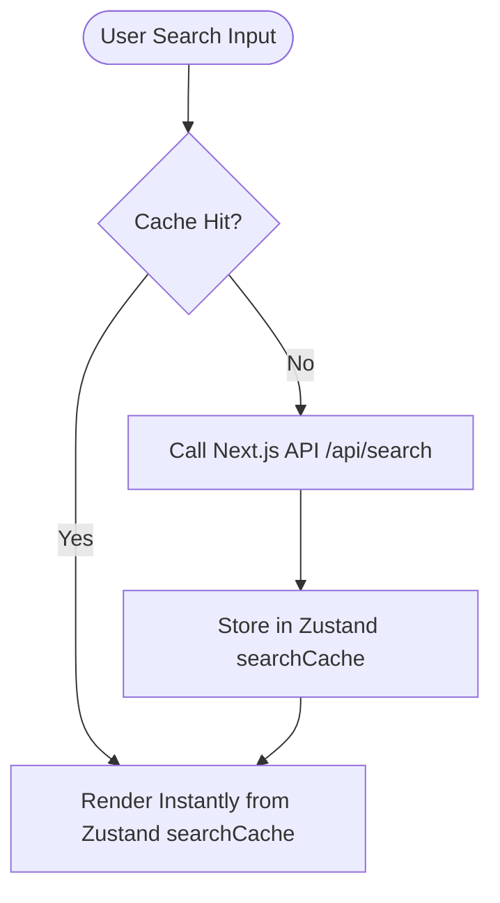
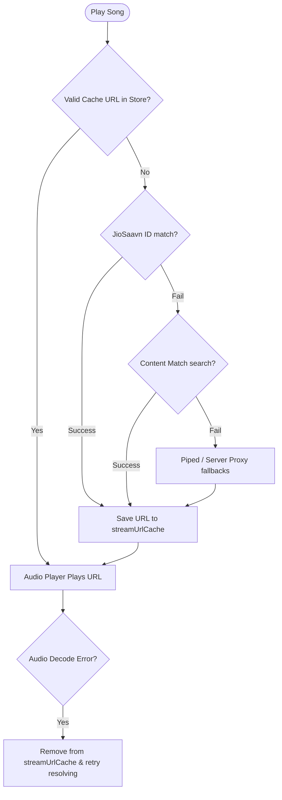

<div align="center">
  
  # 🎵 FlowTunes

  **A fast, beautifully animated, responsive, and data-efficient music streaming app.**

  Built on **Next.js 16**, **React 19**, and **Supabase**, with dynamic aesthetic themes and offline-first client-side state caching.

  [](https://nextjs.org/)
  [](https://react.dev/)
  [](https://supabase.com/)
  [](https://tailwindcss.com/)
  [](https://opensource.org/licenses/MIT)

</div>

---

## 🌟 Key Features

* **🎨 Dynamic Vibe Themes**: Automatically extracts dominant colors from the currently playing song's thumbnail in real-time using HTML Canvas, updating global CSS theme variables to wash the UI in a smooth, immersive ambient glow.
* **🔄 Seamless Stream Switching**: Implements a synchronized player state machine that immediately pauses the active track and clears the audio buffer on song changes, preventing old audio bleed.
* **🎵 Animated Playback Feedback**: Integrates custom CSS-based micro-animated audio visualizer bars (soundwave animations) that bounce on cards during playback. Play/pause buttons are synced across all grid lists and act as click toggles.
* **⚡ Smart Search & Cache**: Unified search for songs, artists, and albums. Search queries, auto-completions, and lyric lines are saved locally using **Zustand** + **Immer** to save bandwidth and ensure instant page loads.
* **🛡️ Self-Healing Media Stream Resolver**: Stream URLs are cached with a 1-hour expiry. If a stream fails (due to key expiration or network issues), FlowTunes automatically clears the cache, resolves a fresh URL through fallbacks, and retries.
* **📜 Synced Lyrics**: Real-time synced lyric panel scrolling using JioSaavn & LRCLIB metadata integration.
* **📋 Deduplicated Activity Logging**: Optimized database querying and unique Set filtering to ensure the "Recently Played" list shows the top 6 *unique* recently played songs without duplicates.
* **🔑 Robust Authentication**: Built-in Supabase authentication supporting password-based login/signup, Google OAuth, and secure session management.

---

## 🛠️ Tech Stack

- **Frontend**: Next.js 16 (App Router), React 19, Tailwind CSS v4, Framer Motion, Lucide Icons.
- **State Management**: Zustand with Persist and Immer middleware.
- **Backend & Database**: Supabase (PostgreSQL with Row Level Security & JWT Authentication).
- **APIs**: Vercel-deployed JioSaavn API, Piped / Invidious stream APIs, LRCLIB for lyrics.

---

## 📁 Folder Structure

```text
flowtunes/
├── app/                  # Next.js App router pages & API endpoints
│   ├── (main)/           # Primary application routes (Home, Library, Liked, Playlists)
│   ├── api/              # Proxy endpoints (home feed, stream resolver, lyrics, search)
│   └── auth/             # Login, signup, and OAuth callbacks
├── components/           # Reusable UI React components
│   ├── layout/           # Sidebar, bottom nav, player bar
│   ├── player/           # Extended audio player interfaces
│   ├── lyrics/           # Lyrics scroll controller
│   └── ui/               # Context menus, sliders, modals
├── context/              # Context Providers (PlayerContext - core playback state machine)
├── lib/                  # Helper utilities and stores
│   ├── store/            # Zustand global caches & store configuration
│   ├── supabase/         # Supabase ssr client utilities
│   └── vibe.ts           # Canvas-based color extraction algorithms
├── types/                # TypeScript type definitions
└── supabase-schema.sql   # SQL script to setup database tables and triggers
```

---

## 🚀 Local Setup

### 1. Clone & Install Dependencies
```bash
git clone https://github.com/yash9359/FLOWTUNES.git
cd FLOWTUNES
npm install
```

### 2. Configure Environment Variables
Create a `.env.local` file in the project root:
```env
NEXT_PUBLIC_SUPABASE_URL=your-supabase-project-url
NEXT_PUBLIC_SUPABASE_ANON_KEY=your-supabase-anon-key
ADMIN_EMAILS=admin@example.com,developer@example.com
NEXT_PUBLIC_ADMIN_EMAILS=admin@example.com,developer@example.com
```

### 3. Setup Database Schema
Execute the SQL scripts from [supabase-schema.sql](file:///d:/Projects/flowtunes/supabase-schema.sql) in the **Supabase SQL Editor** to set up:
- `profiles`: stores user details.
- `songs`: caches track details.
- `liked_songs`: handles user favorites.
- `playlists` & `playlist_songs`: handles custom user playlists.
- `recently_played` & `search_history`: tracks user logs and activity history.

### 4. Run Development Server
```bash
# Standard dev server
npm run dev

# Optimized low-memory dev server (prevents out-of-memory errors on limited systems)
npm run dev:lowmem
```

---

## ⚙️ Core Architecture & Caching Strategy

To run efficiently on free tiers, FlowTunes manages network overhead by running a client-side database caching layer:

### Search & Autocomplete Cache


### Self-Healing Stream Resolution Cache


---

## 📜 Development Scripts

- `npm run dev`: Starts standard Next.js development server.
- `npm run dev:lowmem`: Next.js development server with limited heap size (Max old space 1GB).
- `npm run build`: Compiles production optimized build.
- `npm run start`: Serves production builds locally.
- `npm run lint`: Analyzes codebase for errors or stylistic issues.

---

## 📄 License
This project is licensed under the **MIT License**. See the `LICENSE` file for details.
