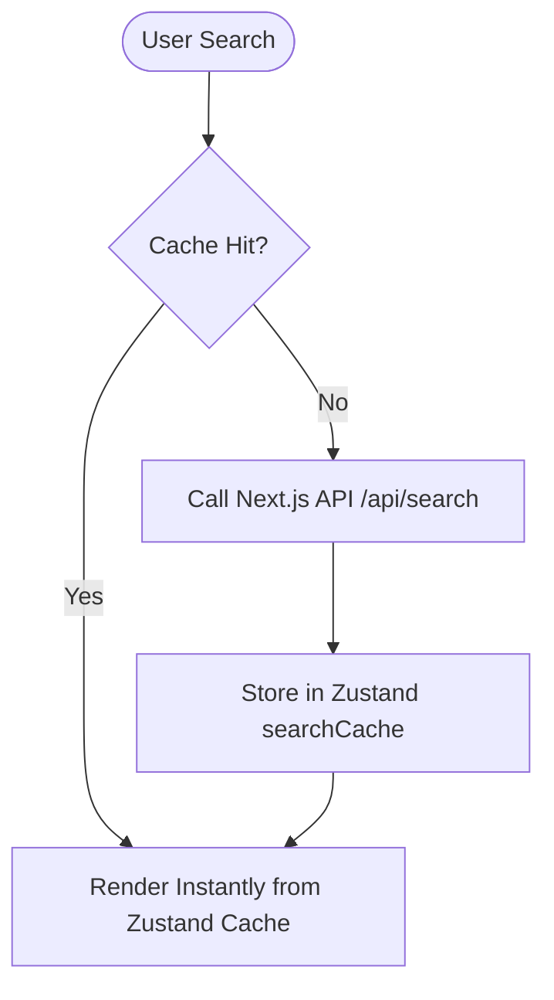
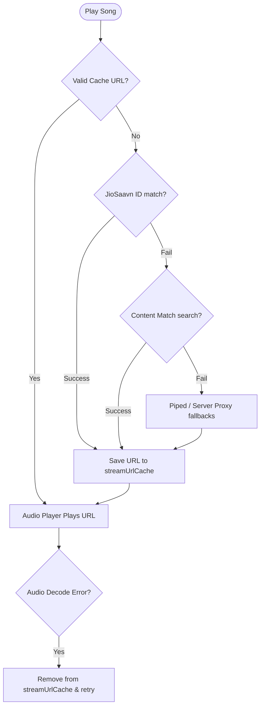

# FlowTunes

A fast, responsive, and data-efficient music streaming app built on Next.js 16 and Supabase.

We designed FlowTunes to stream music directly using JioSaavn API endpoints (with direct 320kbps media links) and Piped/Invidious proxies as fallback. Because rate limits and Vercel serverless function execution times are a constraint, this project implements client-side state caching using Zustand (with Immer and LocalStorage persistence) to cache searches, suggestions, media streams, and lyrics. This means subsequent tracks, page transitions, and repeated queries fetch instantly with zero network overhead.

## Key Features

* **Smart Search**: Unified search for songs, artists, and albums powered by a Vercel-deployed JioSaavn API instance.
* **Persistent Caching**: Zustand state cache for searches, autocompletions, lyrics, and stream URLs to minimize API calls and protect Vercel usage limits. 
* **Stream Cache & Recovery**: Media stream URLs are cached with a 1-hour expiration. If a stream fails to decode, the player automatically invalidates the cache and resolves a fresh stream URL on retry.
* **PWA & Offline Assets**: Set up with a service worker configuration to run smoothly as a standalone application.
* **Supabase Integration**: Stores user profiles, playlists, liked songs, recently played tracks, and search histories. Supports email/password credentials and Google OAuth.
* **Dynamic Player Queue**: Automatically builds playlists and enriches the play queue with related artist tracks.

## Stack

* **Frontend**: Next.js 16 (App Router), React 19, Tailwind CSS v4, Framer Motion
* **State**: Zustand (with Persist + Immer)
* **Backend & DB**: Supabase (Auth + PostgreSQL with RLS)
* **API Providers**: JioSaavn API, LRCLIB, Piped API

---

## Local Setup

### 1. Clone & Install

```bash
git clone https://github.com/yash9359/FLOWTUNES.git
cd FLOWTUNES
npm install
```

### 2. Configure Environment

Create a `.env.local` file in the project root:

```env
NEXT_PUBLIC_SUPABASE_URL=your-supabase-project-url
NEXT_PUBLIC_SUPABASE_ANON_KEY=your-supabase-anon-key
ADMIN_EMAILS=admin@example.com,developer@example.com
NEXT_PUBLIC_ADMIN_EMAILS=admin@example.com,developer@example.com
```

*Note: `ADMIN_EMAILS` allows specified users to access basic dashboard stats.*

### 3. Database Schema

Execute the SQL definitions from your schema file (`supabase-schema.sql`) inside the Supabase SQL Editor to provision the tables:
* `profiles` (User metadata)
* `songs` (Cached track catalog)
* `liked_songs` (User likes)
* `playlists` & `playlist_songs` (Custom user playlists)
* `recently_played` & `search_history` (User activity logs)

### 4. Running the App

```bash
# Start development server
npm run dev

# Start development server on low-RAM machines (prevents Turbopack out-of-memory errors)
npm run dev:lowmem
```

---

## Development Scripts

* `npm run dev`: Standard development server.
* `npm run dev:lowmem`: Dev server optimized for machines with limited RAM.
* `npm run build`: Generates optimized production build.
* `npm run start`: Runs the built application in production mode.
* `npm run lint`: Performs static analysis checking for code errors.

## Caching Strategy Details

To keep the application highly scalable on Vercel's free tier, the custom Zustand store manages several caching behaviors:
1. **Search results** (`searchCache`) and **auto-completions** (`suggestionsCache`) are stored locally up to 50/100 entries. Re-typing query keys loads results instantly.
2. **Lyrics** (`lyricsCache`) are saved by song ID upon the first fetch, avoiding repeated calls when opening the lyrics panel.
3. **Stream URLs** (`streamUrlCache`) are saved with a timestamp and expire after 1 hour. If a media URL returns an error (e.g. expired authentication key), `PlayerContext` catches the media error, evicts it from the cache, and automatically requests a new working stream.

### Architecture Flows

#### Search Caching Flow


#### Stream Resolution Flow

